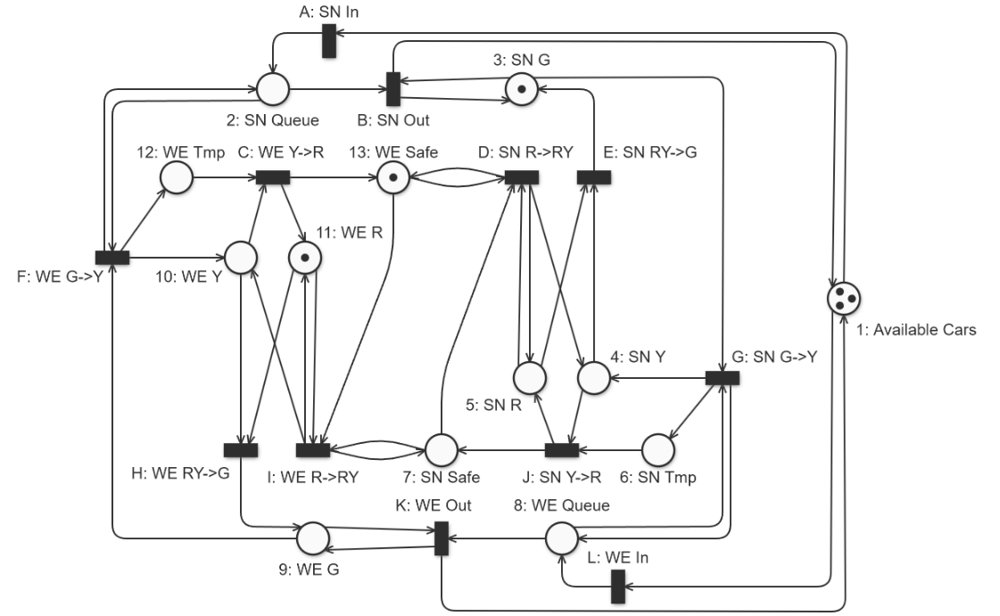
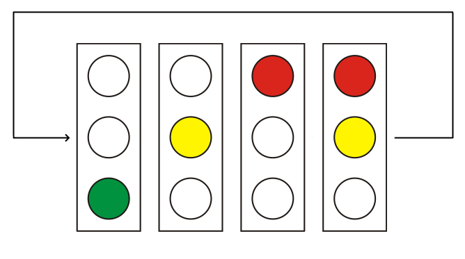
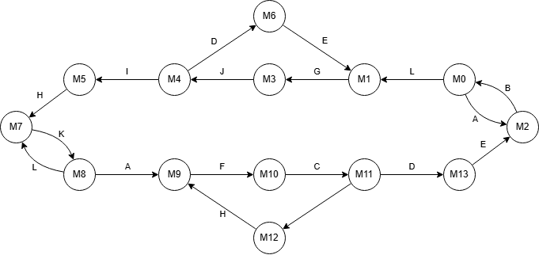

# PetriSemaphore

> **VŠB-TUO** — School project · Parallel and Distributed Systems (PES)


A Petri Net model and analysis of a traffic light system for a two-direction road intersection, submitted for the PES (Parallel and Distributed Systems) course at VŠB-TUO.

<p align="center">
  
</p>

## About

The model represents a semaphore synchronization network covering north-south and east-west traffic flows. It demonstrates signal state transitions, vehicle queuing, and safety properties that prevent simultaneous green lights in conflicting directions. The report covers the formal Petri Net model, reachability analysis, and correctness proofs.

## Showcase

<p align="center">
  
  &nbsp;
  
</p>

## Running the simulation

1. Open the [Petri Net Editor](https://pes.vsb.cz/petrineteditor/#/model).
2. Load the `.npn` file from the `assets/net/` directory of this repository.
3. Use the editor to step through states and evaluate traffic conditions.

A full exported analysis is available in the [Releases](https://github.com/Firestone82/PetriSemaphore/releases) section.

## Build (LaTeX report)

1. Compile the document:
   ```bash
   pdflatex main.tex
   ```

## License

This project was created as a school assignment at VŠB-TUO.
