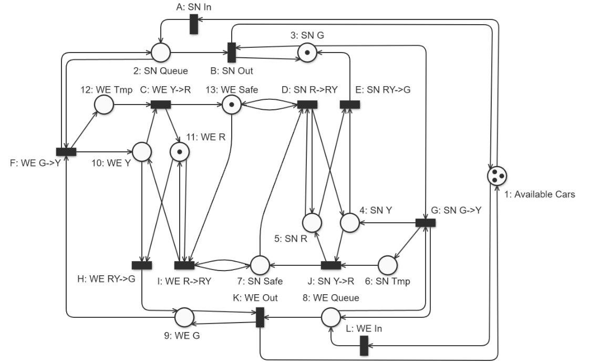

# Project for PES: Semaphore Network Modeled in Petri Net
- Author: Pavel Mikula (MIK0486)  
- Estimated Time Spent: ~26 hours

## Project Overview
This project models a **traffic light system for an intersection** using a Petri Net. The system captures:
- **Traffic signal states** for two directions: **north-south (NS)** and **east-west (EW)**.
- **Vehicle queues** at the intersection for both directions.

The simulation transitions through different states, representing:
- Changes in traffic light colors.
- Vehicle movements through the intersection.

Safety synchronization mechanisms are implemented to **prevent vehicle collisions**, ensuring a safe and efficient traffic flow between the two directions.

## Usage
To explore and simulate the model:
1. Open the [Petri Net Editor](https://pes.vsb.cz/petrineteditor/#/model).
2. Import the `.npn` file located in the `assets/net` folder of this repository.

The model is **preconfigured for simulation**, allowing you to:
- Observe the system's behavior.
- Test various traffic scenarios directly in the editor.

## Release Information
A fully exported description of this network is available in the **Release** section of this repository.

## Showcase

